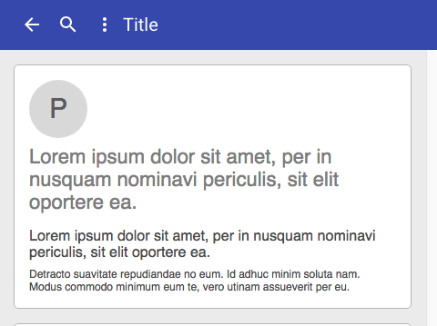

# cells-paper-scroll-header-panel

`cells-paper-scroll-header-panel` contains a header section and a content section.  The
header is initially on the top part of the view but it scrolls away with the
rest of the scrollable content.  Upon scrolling slightly up at any point, the
header scrolls back into view.  This saves screen space and allows users to
access important controls by easily moving them back to the view.

__Important:__ The `cells-paper-scroll-header-panel` will not display if its parent does not have a height.

```html
<cells-paper-scroll-header-panel>
  <paper-toolbar slot="header-content">
  </paper-toolbar>
  <div class="content" slot="main-content">
  <sample-content size="100"></sample-content>
  </div>
</cells-paper-scroll-header-panel>
```

### Styling

The following custom properties and mixins are available for styling:

### Custom Properties
| Custom Property                                            | Selector         | CSS Property | Value               |
| ---------------------------------------------------------- | ---------------- | ------------ | ------------------- |
| --cells-paper-scroll-header-panel__config-margin-top       | #mainContainer   | margin-top   | `No fallback value` |
| --cells-paper-scroll-header-panel-header-container-z-index | #headerContainer | z-index      |  1                  |
### @apply
| Mixins                                                  | Selector           | Value |
| ------------------------------------------------------- | ------------------ | ----- |
| --cells-paper-scroll-header-container                   | #mainContainer     | {}    |
| --cells-paper-scroll-header-panel-container             | #mainContainer     | {}    |
| --cells-paper-scroll-header-panel-header-container      | #headerContainer   | {}    |
| --cells-paper-scroll-header-panel-bg-container          | .bg-container      | {}    |
| --cells-paper-scroll-header-panel-full-header           | #headerBg          | {}    |
| --cells-paper-scroll-header-panel-condensed-header      | #condensedHeaderBg | {}    |
| --cells-paper-scroll-header-panel-condensed-full-header | #condensedHeaderBg | {}    |
