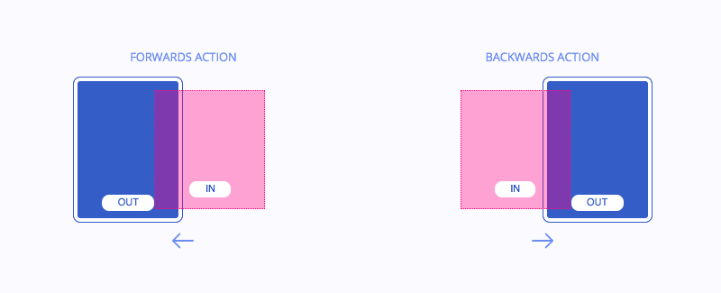
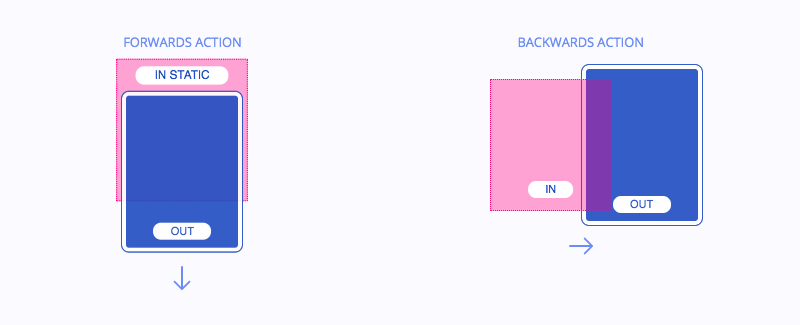
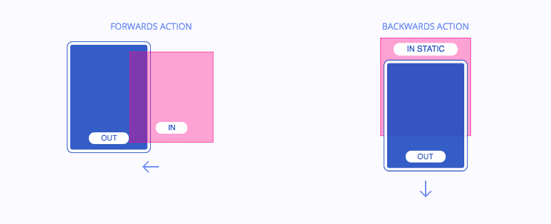
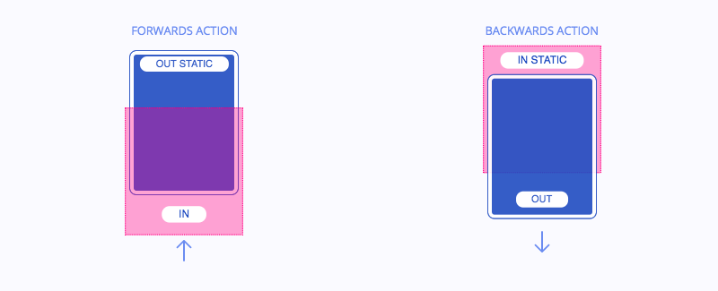
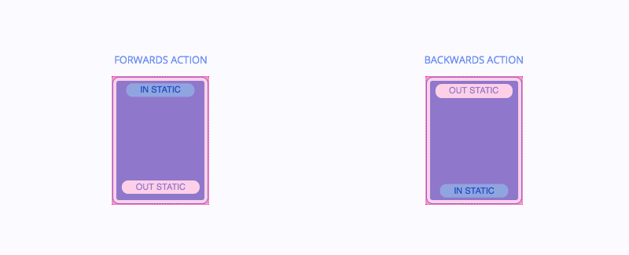

# cells-template-animation-behavior

[](http://bbva-files.s3.amazonaws.com/cells/bbva-catalog/index.html)

`Polymer.CellsTemplateAnimationBehavior` is a behavior to manage template animations (transitions between pages).


#### Import

1) Import the behavior in your component:

```html
<link rel="import" href="../cells-template-animation-behavior/cells-template-animation-behavior.html">
```

2) Add Polymer.CellsTemplateAnimationBehavior to the behaviors list in the JS file or script of your component:

```js
behaviors: [
  Polymer.CellsTemplateAnimationBehavior
]
```

3) Add `cells-template-animation-behavior-styles` in the style tag of your component:

```html
<style include="name-your-component-styles cells-template-animation-behavior-styles"></style>
```

## Available animation types

The animation type is established setting different values for the `animation-type` attribute for the outgoing and incoming pages.

### `horizontal` (default)
Both pages have a horizontal transition in both directions (forwards and backwards).



### `verticalDownForwards`
The outgoing page has a vertical transition (to bottom) in the forwards direction and a horizontal transition (to the right) in the backwards direction.

**animation-type**
- outgoing page: `verticalDownForwards`
- incoming page: `horizontal`



### `verticalDownBackwards`
The outgoing page has a horizontal transition (to the left) in the forwards direction and a vertical transition (to bottom) in the backwards direction.

**animation-type**
- outgoing page: `horizontal`
- incoming page: `verticalDownBackwards`



### `verticalUp` (modal behavior)
The outgoing page remains static while the new page appears over it with a vertical transition (from bottom to top) in the forwards direction. The outgoing page disappears with a vertical transition (to bottom) revealing the previous page below it.

**animation-type**
- outgoing page: `static`
- incoming page: `verticalUp`



### `staticEver` (no animation)
There is no visible animation between pages.

**animation-type**
- outgoing page: `staticEver`
- incoming page: `staticEver`



## Reset scroll in cached template

To reset the scroll in a template after navigating to another page, set the property `resetScroll` to `true` in the template you want to reset. By default, the scroll is reset in a node with ID `app__main`. If your template does not have that node, you should specify the node in which the scroll will be reset using the property `scrollerNode`. This attribute expects a CSS selector like `#app__main`.

Example (json or js in app config):

```js
template: {
  tag: 'cells-template-1-column-right-sidebar',
  properties: {
    animationType: 'verticalUp',
    resetScroll: true,
    scrollerNode: '#some-node'
  }
}
```
## Styling

The following custom properties and mixins are available for styling:

### Custom Properties
| Custom Property                            | Selector                          | CSS Property                      | Value                         |
| ------------------------------------------ | --------------------------------- | --------------------------------- | ----------------------------- |
| --cells-template-animation-duration        | :host(.template-animation-static) | -webkit-animation-duration        |  230ms                        |
| --cells-template-animation-duration        | :host(.template-animation-static) | animation-duration                |  230ms                        |
| --cells-template-animation-timing-function | :host(.template-animation-static) | -webkit-animation-timing-function |  cubic-bezier(0.4, 0, 0.2, 1) |
| --cells-template-animation-timing-function | :host(.template-animation-static) | animation-timing-function         |  cubic-bezier(0.4, 0, 0.2, 1) |
### @apply
| Mixins                     | Selector | Value |
| -------------------------- | -------- | ----- |
| --cells-template-animation | :host    | {}    |