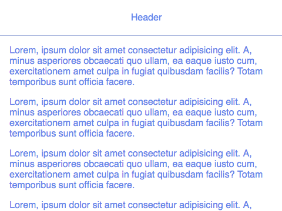

cells-template-paper-drawer-panel

 

[Demo of component in Cells Catalog](https://bbva-ether-cellscatalogs.appspot.com/?view=demo#/component/cells-template-paper-drawer-panel)

## A set of zones elements for your template. It includes:

__cells-template-paper-drawer-panel__ contains a drawer panel and a main panel. The drawer and the main panel are side-by-side with drawer on the left.

  ```app__header``` - A container element for top app.

  ```app__main``` - A container element main content and general manager scroll.

  ```app__footer``` - A container element for bottom app.

  ```app__complementary``` - A container element for drawer. [```Navigation drawer*```](https://www.google.com/design/spec/patterns/navigation-drawer.html)

  ```app__overlay``` - A container element for overlay all content.

  ```app__transactional``` - A container element that positions transverse layers.

[__*The navigation drawer slides in from the left and contains the navigation destinations for your app.__](https://www.google.com/design/spec/patterns/navigation-drawer.html)

Example cells context: *(view demo for declarative app)*
```html
<cells-template-paper-drawer-panel></cells-template-paper-drawer-panel>

<cells-template-paper-drawer-panel right-drawer drawer-width="300px"></cells-template-paper-drawer-panel>
```
## Styling

The following custom properties and mixins are available for styling:

### Custom Properties
| Custom Property                                          | Selector                                                     | CSS Property     | Value |
| -------------------------------------------------------- | ------------------------------------------------------------ | ---------------- | ----- |
| --cells-template-paper-drawer-panel-footer-height        | :host([has-footer]) > --cells-paper-scroll-header-container: | padding-bottom   |  60px |
| --cells-template-paper-drawer-panel-footer-bg-color      | :host([has-footer]) .app__footer                             | background-color |  #fff |
| --cells-template-paper-drawer-panel-footer-height        | :host([has-footer]) .app__footer                             | height           |  60px |
| --cells-template-paper-drawer-panel-section-zindex       | .app__section                                                | z-index          |  0    |
| --cells-template-paper-drawer-panel-section-bg           | .app__section                                                | background-color |  #fff |
| --cells-template-paper-drawer-panel-header-zindex        | .app__header                                                 | z-index          |  0    |
| --cells-template-paper-drawer-panel-main-padding-top     | .app__main                                                   | padding-top      |  0    |
| --cells-template-paper-drawer-panel-main-padding-bottom  | .app__main                                                   | padding-bottom   |  0    |
| --cells-template-paper-drawer-panel-complementary-width  | .app__complementary                                          | width            |  100% |
| --cells-template-paper-drawer-panel-complementary-zindex | .app__complementary                                          | z-index          |  0    |
| --cells-template-paper-drawer-panel-overlay-zindex       | .app__overlay                                                | z-index          |  0    |
| --cells-template-paper-drawer-panel-transactional-zindex | .app__transactional                                          | z-index          |  0    |
### @apply
| Mixins                                                      | Selector                                                     | Value |
| ----------------------------------------------------------- | ------------------------------------------------------------ | ----- |
| --cells-template-paper-drawer-panel                         | :host                                                        | {}    |
| --cells-template-paper-drawer-panel-scroll-header-container | :host([has-footer]) > --cells-paper-scroll-header-container: | {}    |
| --cells-template-paper-drawer-panel-has-footer              | :host([has-footer])                                          | {}    |
| --cells-template-paper-drawer-panel-footer                  | :host([has-footer]) .app__footer                             | {}    |
| --cells-template-paper-drawer-panel-state-active            | :host([state="active"])                                      | {}    |
| --cells-template-paper-drawer-panel-containersection        | .app__section                                                | {}    |
| --cells-template-paper-drawer-panel-section                 | .app__section                                                | {}    |
| --cells-template-paper-drawer-panel-header                  | .app__header                                                 | {}    ||
